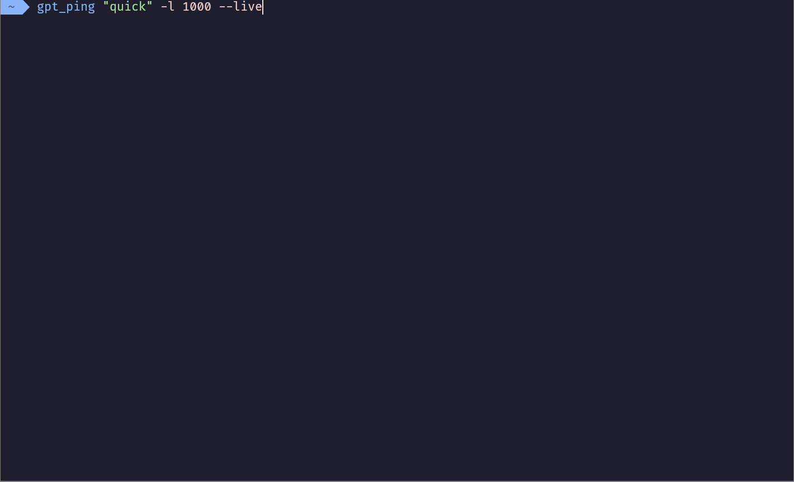

# Meeseeks Box:
An interface allowing you to communicate with different large languages models (only chat-gpt supported currently) easily and allowing them to communicate with one another.

To interact with chat-gtp in the usual chat mode (plus some local commands) run 


### Examples

`gpt-ping`


##### Finding prime numbers with rust:

(sped up 300%)
##### Ploting graphs with python:

##### Latex rendring capabilities:


## Requirements

Currently only works on Linux and MacOs 

`phython >= 3.8`

Requires the [`glow`](https://github.com/charmbracelet/glow) program for printing (to be made optional soon)


###### (optional)
`LaTeX` and `kitty` teminal are both required for the png redering of latex


## Installation

Clone this repo, cd into the directory and run the install script

```
git clone https://github.com/AmdaUwU/meeseeks-box
cd messeeks-box
./install.sh
```


# Todo:
- [x] Command help
- [ ] multi-meeseeks conversation
- [x] Terminal feedback
- [ ] Add hyperlinks to run command ?
- [ ] Summon other messeks
- [x] Make glow code block *blockier* 
- [x] Implement `stream` api
- [ ] Add a method to load conversation
- [x] Add a token counter
- [ ] Add other llm
- [x] find a way to display images (only works with kitty for now)
- [ ] Make fancy printing optional (glow)
- [x] Add a reset command 
- [x] Active local environment automatically 
- [x] open in markdown editor
- [ ] add command to copy code block
- [x] Add install script and install instruction
- [x] Fix bugs on Mac

- Action mode:
    - [x] Fix bug with no `--live` flag
    - [ ] rework
    - [x] Use the new builtin function calling api thing instead of whatever jank i had before.


- Live mode:
	- [x] make live less bugy
	- [x] implement code parsing
    - [ ] fix 'too long line' bug
    - [x] live parsing for 'action' keywords
